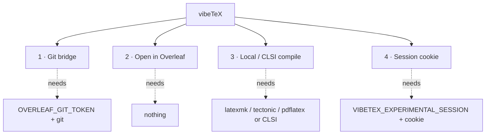

vibeTeX is built around **four capability tiers**. They are auto-detected at startup and degrade gracefully — vibeTeX always offers the most it can given your environment. Call [`overleaf_whoami`](/docs/tools-reference#overleaf_whoami) first in any session: it reports the active tiers, which TeX binaries are on `PATH`, and the configured projects.

## The four tiers

### 1 · Git bridge — the robust core

The official Overleaf **git authentication token** gives full read/write plus commit history. This is the recommended path: your project becomes a real working copy you can pull, edit, push, and diff.

- **Needs:** `git` installed **and** `OVERLEAF_GIT_TOKEN`. The token is an Overleaf **premium** feature (project *Menu → Git*).
- **Gives:** [`overleaf_pull`](/docs/project-sync), `overleaf_status`, `overleaf_push`, `overleaf_history`, and all file ops.
- **Note:** never auto-poll the git endpoint — it rate-limits with roughly a one-minute recovery.

### 2 · Open in Overleaf — no auth, one-way

Turn generated LaTeX (raw content, a file set, or a zip URL) into a **brand-new** Overleaf project via Overleaf's public "Open in Overleaf" endpoint.

- **Needs:** nothing — always available.
- **Gives:** [`overleaf_create_project`](/docs/creating-projects). One-way: it creates a project, it does not sync back.

### 3 · Local / CLSI compile — no premium needed

Compile to PDF and parse the log without any Overleaf account, using a local TeX engine or a self-hosted CLSI.

- **Needs:** `latexmk` (preferred), `tectonic` (zero-TeXLive), or `pdflatex` on `PATH`; **or** a `VIBETEX_CLSI_URL`.
- **Gives:** [`latex_compile`](/docs/compiling), `latex_log`, `latex_get_pdf`, and the [quality checks](/docs/quality-checks).

### 4 · Session cookie — unofficial, experimental, OFF by default

The **only** way free-tier Overleaf users get list / pull / push / compile against their cloud projects. Best-effort and ToS-grey; you paste your own cookie.

- **Needs:** `VIBETEX_EXPERIMENTAL_SESSION=true` **and** `OVERLEAF_SESSION_COOKIE`.
- **Gives:** session-tier project listing and sync — see [Free-tier (experimental)](/docs/free-tier-experimental).

## Capability matrix

| Capability | Git bridge | Open in Overleaf | Local / CLSI | Session cookie |
|---|---|---|---|---|
| Auth required | Paid git token | None | None | Your session cookie |
| List projects | ✓ | — | — | ✓ (experimental) |
| Pull / read | ✓ | — | local files | ✓ (experimental) |
| Edit / push | ✓ | — | local files | ✓ (experimental) |
| Commit history | ✓ | — | — | — |
| Create new project | — | ✓ | — | — |
| Compile to PDF | via local/CLSI | — | ✓ | via local/CLSI |
| Quality checks | ✓ | — | ✓ | ✓ |
| Stability | robust | robust | robust | best-effort |

## What `overleaf_whoami` returns

`overleaf_whoami` is read-only and takes no arguments. It reports:

- the active tiers (`gitBridge`, `openInOverleaf`, `localCompile`, `clsi`, `experimentalSession`);
- which binaries are on `PATH` (`latexmk`, `tectonic`, `pdflatex`, `xelatex`, `lualatex`, `chktex`, `latexindent`, `texcount`);
- configured projects (default + aliases) with their git URLs;
- the resolved compile engine and the Overleaf base URLs.

Use it to decide: if git + token are present, prefer `overleaf_pull` / `overleaf_push`; otherwise use `overleaf_create_project` or a local `latex_compile`.
