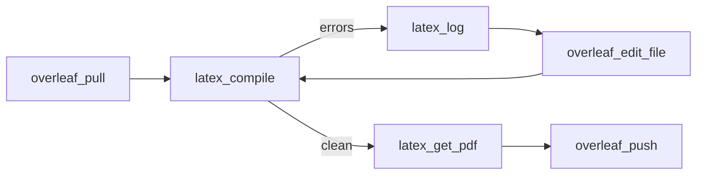

vibeTeX compiles your LaTeX to PDF and parses the log, **with or without an Overleaf account**. This is [tier 3](/docs/capability-tiers#3--local--clsi-compile--no-premium-needed): it works as long as a TeX engine is on `PATH`, or you point at a self-hosted CLSI.

## Tools

### `latex_compile`

Build the project to PDF.

| Argument | Purpose |
|---|---|
| `project` | Alias or 24-hex id. Omit for the default. |
| `root` | Root `.tex` to compile, relative to the working copy. Omit to auto-detect (the `\documentclass` file, else `main.tex`). |
| `engine` | Force an engine. Omit to use the configured/auto engine. |

It returns success/failure, the resolved engine, the PDF path, and a structured summary of errors and warnings parsed from the log.

### `latex_log`

Parse the **latest** compile log into structured diagnostics (errors, warnings, over/underfull boxes) with file and line numbers — without recompiling.

### `latex_get_pdf`

Locate the compiled PDF (e.g. `main.tex` → `main.pdf`), or the freshest `.pdf` in the working copy. Pass `save_path` to also copy it to an absolute path and get that path back.

## Engines

`VIBETEX_COMPILE_ENGINE` (default `auto`) selects the engine:

| Engine | When to use |
|---|---|
| `auto` | **Default.** Picks the best available binary on `PATH`. |
| `latexmk` | Preferred — handles multi-pass runs, bib, and reruns automatically. |
| `tectonic` | Zero-TeXLive: a single binary that fetches packages on demand. Great for clean machines and CI. |
| `pdflatex` | Classic single-pass PDF output. |
| `xelatex` / `lualatex` | Unicode / system fonts / modern TeX. |

`overleaf_whoami` lists exactly which of these are installed.

## Self-hosted CLSI (remote compile)

Set `VIBETEX_CLSI_URL` to a [CLSI](https://github.com/overleaf/overleaf) (Common LaTeX Service Interface) instance and vibeTeX will compile remotely instead of locally — useful when you can't install TeX on the host running vibeTeX.

```bash
VIBETEX_CLSI_URL=https://clsi.example.com \
npx -y @oscardvs/vibetex
```

## A typical compile cycle



Because compilation is local, your assistant can iterate on errors fast and only push once the document builds clean.
