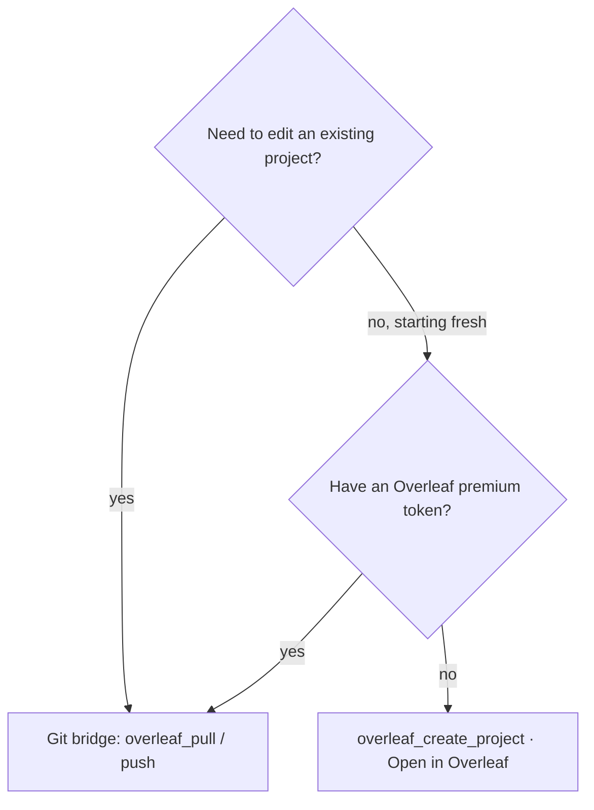

[Tier 2](/docs/capability-tiers#2--open-in-overleaf--no-auth-one-way) uses Overleaf's public **"Open in Overleaf"** endpoint to create a *brand-new* project from LaTeX your assistant generated. It needs no token and no account — but it is **one-way**: it creates a project, it does not sync back. For round-trip editing, use the [git bridge](/docs/project-sync).

## overleaf_create_project

Seed a new project three ways (mutually exclusive):

| Argument | Purpose |
|---|---|
| `content` | A single raw-LaTeX main document. |
| `files` | An array of `{ name, content }` or `{ name, uri }` — multiple files, each inline or fetched from a public URL. |
| `zip_uri` | A public URL to a project `.zip`. |
| `engine` | Compile engine for the new project. |
| `main_document` | Filename of the main document (e.g. `main.tex`) when using `files` / `zip_uri`. |

It returns the "Open in Overleaf" URL — your assistant hands you a link that opens the populated project in your browser.

## Examples

### From a single document

```text
You: Draft a two-column IEEE article skeleton and open it in Overleaf.

Claude:
  → overleaf_create_project(
      content: "\\documentclass[conference]{IEEEtran}\n…",
      engine: "pdflatex")
  Open it here → https://www.overleaf.com/docs?snip_uri=…
```

### From multiple files

```text
Claude:
  → overleaf_create_project(
      files: [
        { name: "main.tex", content: "…" },
        { name: "refs.bib", content: "@article{…}" }
      ],
      main_document: "main.tex")
```

### From a zip

```text
Claude:
  → overleaf_create_project(zip_uri: "https://example.com/template.zip")
```

## When to use which tier



"Open in Overleaf" is the fastest way to go from *AI-generated LaTeX* to *a live editable Overleaf project* with zero setup — ideal for templates, starters, and sharing a draft.
