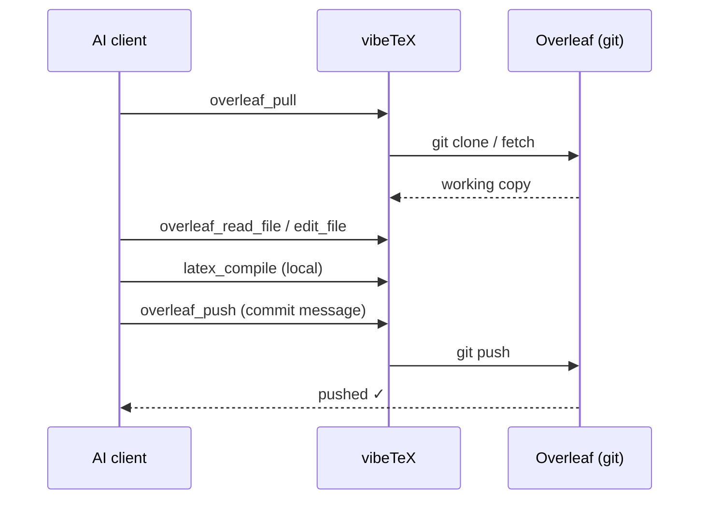

The [git bridge](/docs/capability-tiers#1--git-bridge--the-robust-core) is vibeTeX's robust core. With `OVERLEAF_GIT_TOKEN` set and `git` installed, your Overleaf project becomes a real working copy that your assistant can pull, edit, push, and diff.

> The git authentication token is an Overleaf **premium** feature. Free-tier users can opt into the [experimental session tier](/docs/free-tier-experimental) for similar sync.

## The loop



## Tools

### Pull and inspect

- **`overleaf_pull`** — clone or fast-forward the project into the local working copy. Run this first.
- **`overleaf_status`** — show pending local changes (the working-copy diff).
- **`overleaf_history`** — list recent commits (`limit`, default 20, max 500).
- **`overleaf_list_files`** — list project files, optionally filtered by `kind` (`tex`, `bib`, `style`, `asset`, `other`).

> **Don't auto-poll.** The Overleaf git endpoint rate-limits, with roughly a one-minute recovery. Pull when you need fresh state, not on a timer.

### Read and edit

- **`overleaf_read_file`** — read a file by `path`, optionally a `start_line`–`end_line` window.
- **`overleaf_write_file`** — write a file's full content (creates or overwrites).
- **`overleaf_edit_file`** — exact-string replace: `old_string` → `new_string`, with optional `replace_all`. Copy `old_string` verbatim from `overleaf_read_file`, whitespace included.
- **`overleaf_delete_file`** — delete a file. Gated twice: `confirm: true` **and** `VIBETEX_ALLOW_DELETE=true`.

### Push

- **`overleaf_push`** — commit the working copy and push to Overleaf. Pass an optional `message` (defaults to `vibeTeX: update via MCP`).

### Snapshot

- **`overleaf_download_zip`** — download the whole project as a `.zip` (optional `save_path`).

## Example

```text
You: In my thesis, rename every \citep to \parencite and push.

Claude:
  → overleaf_pull(project: "thesis")
  → overleaf_list_files(project: "thesis", kind: "tex")
  → overleaf_read_file / overleaf_edit_file(replace_all: true) per file
  → overleaf_push(project: "thesis", message: "Switch \citep → \parencite")
  Pushed 1 commit. 7 files updated.
```

Edits are local until you push, so you can `latex_compile` and [reference-check](/docs/quality-checks) before anything reaches Overleaf.
