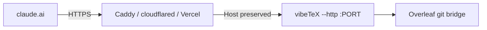

vibeTeX runs over stdio for desktop clients, and over **Streamable HTTP** as a remote MCP server you can add to claude.ai (web) as a custom connector. You have two options: **self-host** the remote for free, or use the **paid hosted** connector.

> The hosted connector domain is a placeholder until the real one is attached: `https://mcp.vibetex.dev/mcp`.

## Option A — self-host (free)

Turn the `/mcp` endpoint into an OAuth 2.1 + PKCE protected resource. Minimum setup:

```bash
VIBETEX_OAUTH_ENABLED=true \
VIBETEX_PUBLIC_URL=https://vibetex.example.com \
VIBETEX_OAUTH_PASSCODE="$(openssl rand -base64 24)" \
OVERLEAF_GIT_TOKEN=your_token \
OVERLEAF_PROJECT_ID=your_project_id \
npx -y @oscardvs/vibetex --http
```

- `VIBETEX_PUBLIC_URL` is the HTTPS origin claude.ai reaches (also the OAuth issuer). Must be HTTPS in production.
- `VIBETEX_OAUTH_PASSCODE` (≥ 12 chars) gates consent — the operator key a user must enter to authorize.
- For persistence across restarts, set `VIBETEX_OAUTH_STORE=file` and `VIBETEX_OAUTH_TOKEN_SECRET="$(openssl rand -base64 32)"` (tokens are encrypted at rest).

See [Configuration → Remote OAuth](/docs/configuration#remote-oauth-claudeai-connector) for the full variable list.

### Put TLS in front

When OAuth is enabled the HTTP transport binds `0.0.0.0` with DNS-rebinding protection. Run a TLS terminator in front and forward the public `Host` header verbatim:



If a proxy rewrites `Host`, add the extra value(s) to `VIBETEX_ALLOWED_HOSTS`.

### Add it in claude.ai

In claude.ai → **Settings → Connectors → Add custom connector**, paste your `VIBETEX_PUBLIC_URL` + `/mcp`, complete the OAuth consent (entering your passcode), and the 23 tools appear.

### Lock it down

For a public endpoint, set `VIBETEX_READ_ONLY=true` to expose only non-mutating tools, and keep `VIBETEX_ALLOW_DELETE=false`.

## Option B — paid hosted (pay once)

Don't want to run anything? The hosted connector is a **one-time €30 license** valid for one year — a managed, always-on instance.

1. Buy the license on the [pricing page](/pricing) (checkout via Polar; you get a key by email).
2. In claude.ai, add the custom connector `https://mcp.vibetex.dev/mcp` and paste your license key.
3. Provide your own Overleaf git token — your projects become available to your AI.

The hosted server uses **your own** Overleaf token only, held for the duration of your session and **never stored beyond it**. See the [Privacy Policy](/privacy) for exactly what it holds. The hosted tier does not use the [experimental session-cookie tier](/docs/free-tier-experimental).

> vibeTeX is an independent open-source project and is not affiliated with, endorsed by, or sponsored by Overleaf or Digital Science.
